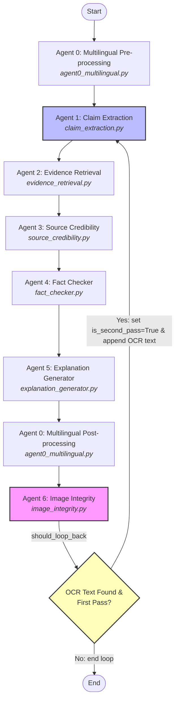

<div align="center">
  <h1>KREDO</h1>
  <p><strong>A Multi-Agent Fake News Detection & Fact-Checking Ecosystem</strong></p>

  <p>
    
    
    
    
  </p>
</div>

<hr />

## 🌟 Overview

**KREDO** is a lightweight, high-precision fake-news detection and fact-checking application. It takes a URL, article text, or image and analyzes it through an advanced multi-agent fact-checking pipeline. 

The application provides a sleek, clinical UI featuring live progress updates, comprehensive source citations, final credibility verdicts, and a verifiable history of past analyses.

---

## 🏗️ Architecture

KREDO is built as a three-part ecosystem:

- 🧠 **Backend (`backend/`)**: FastAPI-based API and the core agent pipeline powered by LangGraph.
- 🎨 **Frontend (`frontend/`)**: Modern React + Vite UI demonstrating the "Verifiable Intelligence" design language.
- 🧩 **Extension (`extension/`)**: A Chrome extension for instant URL checking directly from your browser.

### Backend Environment

Create a `backend/.env` file before running the API. The app reads these variables at startup:

```env
# Core LLM + retrieval keys
GROQ_API_KEY=
TAVILY_API_KEY=
JINA_READER_API_KEY=
SARVAM_API_KEY=

# Optional multilingual controls
SARVAM_API_BASE=https://api.sarvam.ai
MULTILINGUAL_ENABLED=true
MULTILINGUAL_MIN_CONFIDENCE=0.7

# Optional history protection
HISTORY_API_KEY=

# Supabase history store
SUPABASE_URL=
SUPABASE_SERVICE_ROLE_KEY=

# Alternate Supabase-style names supported by the current codebase
project_url_supabase=
secret_key_supabase=
publishable_key_supabase=
anon_key_supabase=
```

If you want the history feature enabled, the Supabase URL and service role key are required. If you only want the analysis pipeline, the app can still run without the history store, but history endpoints will be unavailable.

---

## 🕵️‍♂️ The Agents in KREDO

The project is structured under the [backend/agents/](file:///d:/A_Resume_Projects/KREDO/KREDO/backend/agents) folder and includes the following agents:

*   **Agent 0: Multilingual Translator** ([agent0_multilingual.py](file:///d:/A_Resume_Projects/KREDO/KREDO/backend/agents/agent0_multilingual.py))
    *   *Pre-processing:* Detects the input language and translates non-English content to English using Sarvam AI.
    *   *Post-processing:* Translates the final results/verdicts back to the user's original language before showing it in the UI.
*   **Agent 1: Claim Extraction Agent** ([claim_extraction.py](file:///d:/A_Resume_Projects/KREDO/KREDO/backend/agents/claim_extraction.py))
    *   Scrapes URLs (via Jina Reader) or takes direct text and extracts structured factual claims using Groq (`llama-3.1-8b-instant`), ranking them by checkworthiness.
*   **Agent 2: Evidence Retrieval Agent** ([evidence_retrieval.py](file:///d:/A_Resume_Projects/KREDO/KREDO/backend/agents/evidence_retrieval.py))
    *   Formulates optimal queries for the extracted claims and queries the web using the Tavily Search API.
*   **Agent 3: Source Credibility Agent** ([source_credibility.py](file:///d:/A_Resume_Projects/KREDO/KREDO/backend/agents/source_credibility.py))
    *   Programmatically evaluates the trustworthiness of the source domains based on a local tiered scoring system.
*   **Agent 4: Fact Checker Agent** ([fact_checker.py](file:///d:/A_Resume_Projects/KREDO/KREDO/backend/agents/fact_checker.py))
    *   Cross-references the claims against the retrieved evidence using Groq (`llama-3.3-70b-versatile`) to generate verdicts (True, False, Misleading, etc.).
*   **Agent 5: Explanation Generator Agent** ([explanation_generator.py](file:///d:/A_Resume_Projects/KREDO/KREDO/backend/agents/explanation_generator.py))
    *   Synthesizes the overall verdict, reasoning, and citations into a clean Markdown report.
*   **Agent 6: Image Integrity Agent** ([image_integrity.py](file:///d:/A_Resume_Projects/KREDO/KREDO/backend/agents/image_integrity.py))
    *   Extracts images from the article, inspects their EXIF metadata for editing tools (Photoshop/GIMP), and performs OCR via Sarvam AI.

---

## 🔄 The Agent Loop (Feedback Loop)

In LangGraph, we define an agentic "loop" when the graph has a cyclic relationship where agents can route back to previous steps based on conditional evaluations. KREDO has a built-in agent loop between **Agent 6 (Image Integrity)** and **Agent 1 (Claim Extraction)**:



### How the Loop Works

1. **First Pass:** The pipeline processes the input (URL, text, etc.).
2. **Execution reaches Image Integrity (Agent 6):** It fetches any embedded images and runs OCR via Sarvam AI.
3. **Loop Detection & Context Enrichment:** If text context is extracted from the images, Agent 6:
    * Translates it into English.
    * Appends it to the pipeline input (`state["user_input"]`).
    * Sets `state["is_second_pass"] = True`.
4. **Conditional Router:** The router function `should_loop_back` (defined in [claim_extraction.py](file:///d:/A_Resume_Projects/KREDO/KREDO/backend/agents/claim_extraction.py)) detects this condition and routes the execution back to **Claim Extraction (Agent 1)**.
5. **Second Pass:** The pipeline runs a second time, now extracting and fact-checking claims from both the original article content and the new image-embedded text context together.
6. **Termination:** On the second pass, the loop terminates (`is_second_pass` is reset to `False` by Agent 6 to prevent infinite looping) and returns the final explanation/verdict to the client.

### Models and Providers

The current project uses a small set of model providers rather than a single monolithic LLM:

| Stage | Provider | Model |
| --- | --- | --- |
| Claim Extraction | Groq | `llama-3.1-8b-instant` |
| Evidence Query Enrichment | Groq | `llama-3.1-8b-instant` |
| Fact Checker Reasoning | Groq | `llama-3.1-8b-instant` |
| Fact Checker Verdict | Groq | `llama-3.3-70b-versatile` |
| Explanation Generation | Groq | `llama-3.1-8b-instant` |
| Image OCR Translation | Groq | `llama-3.3-70b-versatile` |
| URL-to-Markdown Scraping | Jina Reader | API-based service |
| Web Search | Tavily | API-based service |
| Multilingual Detection / Translation | Sarvam AI | API-based service |
| History Storage | Supabase | Postgres-backed table |

Source credibility scoring is handled locally in code and does not call an external model.

### Pipeline Configuration

Most agent defaults are controlled in [backend/core/config.yaml](backend/core/config.yaml). That file is the central place to tune each stage without editing code directly. You can adjust:

- `model` and `provider` for the Groq-backed agents
- `temperature` and output mode settings
- evidence retrieval limits such as `tavily_max_results` and `max_parallel_workers`
- source credibility tier scores
- image and multilingual feature flags

If a value is not set in `config.yaml`, the code falls back to a built-in default in the corresponding agent module.

---

## ✨ Features

- **Multi-Modal Input:** Support for text, URL, and image analysis.
- **Real-Time Progress:** Watch the multi-agent pipeline think and execute in real-time.
- **Verifiable Intelligence UI:** A high-precision, clinical interface built for trust and clarity.
- **Seamless Browser Integration:** One-click checking via the Chrome Extension.
- **History Tracking:** Save and review past credibility analyses.

---

## 🚀 Getting Started

### Prerequisites

- Python 3.10+
- Node.js 16+

### 1. Backend Setup

Create `backend/.env` first and add the keys listed above.

```bash
# Navigate to the project root

# Option A: Using uv (Recommended - installs all dependencies and sets up .venv)
uv sync

# Option B: Using standard Python venv & pip
python -m venv .venv

# Activate virtual environment
# On Windows:
.venv\Scripts\activate
# On Mac/Linux:
# source .venv/bin/activate

# Install dependencies (editable mode)
pip install -e .

# Start the FastAPI server
python backend/main.py
```

### 2. Frontend Setup

Open a new terminal window:

```bash
cd frontend

# Install dependencies
npm install

# Start the Vite development server
npm run dev
```

Visit the local Vite URL, typically `http://localhost:5173`.

### 3. Chrome Extension Setup

1. Open Chrome and navigate to `chrome://extensions/`.
2. Enable **Developer mode** in the top right corner.
3. Click **Load unpacked**.
4. Select the `extension/` folder from this repository.
5. The KREDO extension is now ready to use!

---

## 🧪 Testing & Evaluation

KREDO includes an automated test suite and an evaluation harness to benchmark and verify the accuracy of the multi-agent pipeline.

### Running Automated Tests

To run the unit and integration tests (built with `pytest`):

```bash
# From the project root, with your virtual environment active
python -m pytest
```

### Running the Evaluation Harness

The evaluation harness processes a set of pre-defined test cases (located in `backend/data/eval_dataset.json`), extracting and fact-checking claims, and comparing them against expected ground truth.

To run the evaluation harness:

```bash
# Run evaluation on a subset of test cases (e.g. 5 cases)
python backend/scripts/run_eval.py 5
```
> [!TIP]
> On Windows, prepend `$env:PYTHONIOENCODING="utf-8"` (for PowerShell) or `set PYTHONIOENCODING=utf-8` (for CMD) to prevent terminal Unicode encoding crashes during status printing.

The script generates a detailed Markdown report at `backend/data/eval_report.md` detailing verdict accuracy, token match scores, and domain-level citation precision and recall metrics.

---

## 🛠️ Notes

- **Security:** Ensure that `.env` files and secrets are never committed to Git.
- **Line Endings:** If Git warns about line endings on Windows, ensure you have a `.gitattributes` file with `* text=auto`.

<br/>
<div align="center">
  <sub>Built with ❤️ for a more truthful web.</sub>
</div>
